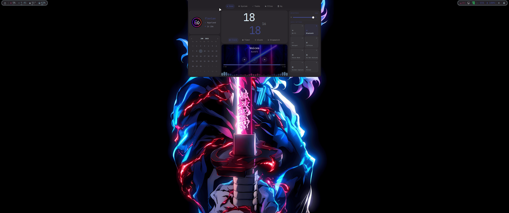
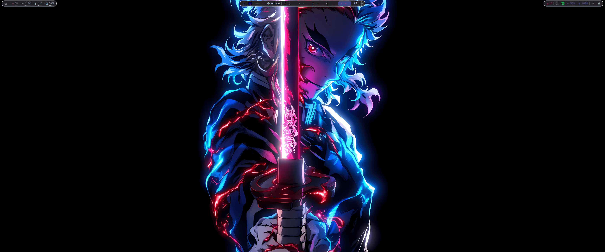
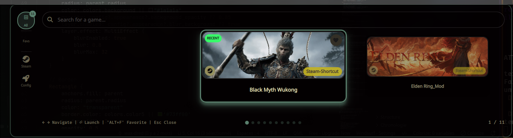

# 🌿 Hyprland Dotfiles – Arch Linux Setup

Welcome to my personal dotfiles for a customized Arch Linux system using **Hyprland** as the Wayland compositor.
This repository contains configuration files for various applications that make up my minimalist and responsive Linux desktop environment.

---

## 🖼️ Preview


---

## 🖥️ Quickbar — Quickshell

Ma barre, mon **dashboard** et mon **panneau tactile** sont faits en **Quickshell**
(`~/.config/quickshell/Quick-Bar`). Toutes les couleurs viennent de **wallust** →
l'ensemble se re-teinte automatiquement à chaque changement de wallpaper.

<div align="center">
  
  <p><em>Bureau avec la Quickbar</em></p>
</div>

<div align="center">
  
  <p><em>Quickbar — autre vue</em></p>
</div>

### 🖐️ TouchPanel — Corsair Xeneon Edge

Un panneau **plein écran sur le tactile Xeneon Edge** (détecté par modèle),
organisé en **onglets** — un clone tactile du dashboard. Activé par la tuile
*Touch Panel* des Quick Settings.

| Onglet | Contenu |
|--------|---------|
| **Home** | Profil, calendrier, horloge/timer/alarme, lecteur média, Quick Settings |
| **System** | CPU/RAM/GPU (jauges wallust), températures, disques, réseau, ventilos, alim |
| **Tasks** | Kanban (JSON local) |
| **Files** | Explorateur type yazi (aperçu `bat`, images) |
| **Wall** | Sélecteur de wallpapers + effets |
| **Eq** | Égaliseur 10 bandes, presets, volume, sortie |
| **Discord** | Chat 2 sens avec un salon *(voir plus bas)* |
| **Apps** | Lanceurs façon Stream Deck *(voir plus bas)* |
| **Games** | Jaquettes de jeux (backend du game-launcher) |

- Barre d'onglets **centrée** et **colorée par wallust** (une couleur par onglet).
- Onglets **lazy-loadés** (chargés à l'ouverture, libérés ensuite) → RAM optimisée.
- Les apps lancées depuis le panneau s'ouvrent sur l'**écran principal**
  (`Bar/Scripts/launch-main.sh`), pas sous le plein écran tactile.

### 💬 Onglet Discord

Chat **2 sens** avec un serveur Discord via un **bot** (bridge Python
`aiohttp`/`websockets`, sans discord.py) : historique, messages en direct,
threads, **embeds et boutons** rendus, et déclenchement de **téléchargements**
(intégration qBittorrent via un endpoint HTTP sur le bot).

**Prérequis :** un bot avec l'intent **Message Content** activé et présent dans le
serveur ; le token dans `~/.config/quickshell/Quick-Bar/.discord_token` *(gitignoré)*.

### 🎛️ Onglet Apps — Stream Deck

Grille tactile de lanceurs en **sections** (Dev / Gaming / Média / Other), une
couleur wallust par section, avec les **vrais logos d'apps** (résolus via le thème
d'icônes, comme rofi). Piloté par `user_data/streamdeck.json`, rechargé à chaud :

```json
[
  {
    "title": "Dev",
    "accent": 4,
    "items": [
      { "icon": "󰅩", "appicon": "windsurf", "label": "Windsurf", "exec": "windsurf" },
      { "icon": "", "appicon": "/usr/share/pixmaps/kitty.png", "label": "Nvim", "exec": "kitty -e nvim" }
    ]
  }
]
```

- `appicon` = nom d'icône (`steam`, `discord`…) **ou** chemin absolu (`/usr/share/…`).
- `icon` = glyphe Nerd Font en secours ; `accent` = index de la palette wallust.
- App **terminale** (nvim, htop…) → à envelopper : `"exec": "kitty -e nvim"`.

### 🎮 Onglet Games

Étagère de **jaquettes** alimentée par le backend du game-launcher (Steam + jeux
manuels + SteamGridDB), lancement au tap.

### 🔐 Après un clone : secrets à recréer

Deux fichiers **gitignorés** (jamais poussés), nécessaires à l'onglet Discord :

```bash
echo "TON_TOKEN_BOT" > ~/.config/quickshell/Quick-Bar/.discord_token
echo "TON_SECRET"    > ~/.config/quickshell/Quick-Bar/.dl_secret   # = DL_API_SECRET de bot.js
chmod 600 ~/.config/quickshell/Quick-Bar/.discord_token ~/.config/quickshell/Quick-Bar/.dl_secret
```

---

## 📦 Included Configurations
This repository includes configuration files for the following applications:
```bash
.config/
├── hypr        # Hyprland WM (configs, scripts, hyprlock, hypridle, hyprpaper)
├── quickshell  # Barre + dashboard + touch panel + game-launcher (QML)
├── rofi        # Application launcher (+ rofi-game-launcher, rofi-games, rofi-spotify)
├── swaync      # Notification center
├── wlogout     # Logout menu
├── kitty       # Terminal
├── fish        # Shell (+ starship.toml)
├── nvim        # Neovim editor
├── zed         # Zed editor
├── yazi / ranger  # File managers (TUI)
├── cava        # Audio visualizer
├── mpv         # Media player
├── fastfetch   # System info
├── btop        # Resource monitor
├── wallust     # Dynamic color scheme manager
├── pypr        # Pyprland (scratchpads…)
├── spicetify   # Spotify customization
├── qt5ct / qt6ct / Kvantum   # Qt theming
├── gtk-3.0 / gtk-4.0         # GTK theming
├── nwg-look / nwg-displays   # GTK & monitor GUI tools
└── MangoHud    # In-game overlay
```
> Aussi inclus : `home_dotfiles/` (`.zshrc`, `.bashrc`), `.themes/gtk` (thème GTK),
> `Pictures/wallpapers`, profil `.zen` (Zen Browser) et `simple-sddm-2/` (thème SDDM).

---

## 🚀 Rofi - Application Launcher and More

### Application Launcher and Ags
My Rofi launcher is customized to integrate seamlessly with my overall theme. It offers a clean and responsive interface for launching your favorite applications.

<div align="center">
  
  <p><em>Rofi Application Launcher</em></p>
</div>

<div align="center">
  
  <p><em>Aylur's GTK Shell (Ags)</em></p>
</div>

Special thanks to [JaKooLit](https://github.com/JaKooLit) for the inspiration.

### Wallpaper Selector
I created a custom wallpaper selector with Rofi that allows you to easily choose and apply wallpapers from a visual interface.

<div align="center">
  
  <p><em>Rofi Wallpaper Selector</em></p>
</div>

#### Using the wallpaper selector:
- **Keyboard shortcut**: `Mod+W` (Mod = Super = Windows Key)
- **Features**:
  - Random wallpaper selection
  - Multi-workspace wallpaper support
  - Special effects for wallpapers
  - MPVpaper for video wallpapers

#### Wallpaper locations:
- **Static wallpapers**: `~/Pictures/wallpapers/`
- **Video wallpapers**: `~/Pictures/wallpapers/Video/`

---

## 🎨 Wallust - Dynamic Themes

Wallust automatically manages my color schemes based on the current wallpaper, creating a cohesive visual experience across the entire system.

### GTK & Thunar Integration
My setup uses a custom GTK configuration based on the [phocus/gtk](https://github.com/phocus/gtk) project that makes Thunar (and all other GTK applications) automatically adapt to the color scheme generated by Wallust.

<div align="center">
  
  <p><em>Thunar file manager with Wallust theme integration</em></p>
</div>

#### Dynamic theme examples:
<div align="center">
  
  <p><em>Theme example 1</em></p>
</div>

<div align="center">
  
  <p><em>Theme example 2 - Notice how colors automatically change</em></p>
</div>

#### How it works:
1. Wallust extracts a color palette from the current wallpaper
2. The phocus/gtk theme reads these colors from Wallust's configuration
3. GTK applications like Thunar automatically adapt their appearance to match the system theme

#### Setup:
1. Install the phocus/gtk theme in `.themes/gtk`
2. Configure Wallust to generate color variables in the format expected by phocus
3. Apply a new wallpaper using the Rofi wallpaper selector (Mod+W)
4. Wallust automatically regenerates the theme based on the new wallpaper

This creates a seamless visual experience where your file manager and other GTK applications automatically match your desktop theme.

---

## 🎮 Game Launcher — Quickshell

Lanceur de jeux maison en **Quickshell** (il remplace l'ancien lanceur Rofi) :
un mode fenêtré et un mode plein écran type console (**Big Mode**), avec
récupération automatique des jaquettes et lancement de chaque jeu selon ses
options préconfigurées.

### Features
- Options préférées par jeu (résolution, plein écran, etc.)
- Configurations de performance optimisées
- Intégration MangoHud (stats en jeu)
- Support des launchers (Steam, Lutris, etc.)

<div align="center">
  
  <p><em>Lanceur de jeux Quickshell</em></p>
</div>

<div align="center">
  
  <p><em>Mode plein écran « Big Mode »</em></p>
</div>

### Game Script Creation

#### Creating a new game script:
1. Run `-01-script-Game` to open the game script interface
2. Select "Create new script" (`-02`)
3. Name your script file (`-03`)
4. Edit the script settings (`-04`)

#### Example configuration (The_Finals):
```bash
GAMESCOPE_OPTIONS="False"
GAME_PERF="True"
GAME_VRR="True"
ANIMATION="True"
MANGOHUD_OPTION="True"
OPTION_AFTER="-useallavailablecores"
LANG_KEY="fr"

# ======= GENERAL SETTINGS =======
MONITOR="DP-2"
RESOLUTION="3440x1440"
REFRESH_RATE="165"
POSITION="0x0"
SCALE="1"

RES_WIDTH=3440
RES_HEIGHT=1440
FSR="True"
```

#### Applying the script:
- Run: `config/hypr/scripts/Gamescope/add_script.sh`
- OR: Select "Run update script" from the `-01-script-Game` menu

#### Using in Steam:
Add to your game's launch options:
```
The_Finals %command% # Launches The Finals with optimized settings
```

---

## 💻 Installation

> ⚠️ **Arch Linux** uniquement. Lance le script en utilisateur normal (pas root) —
> `sudo` est demandé au besoin.

### 🚀 Installation automatique (recommandé)

```bash
git clone https://github.com/Eaquo/Hyprland-Dotfiles-Arch-linux.git hypr-restore
cd hypr-restore
./install.sh
```

Le script `install.sh` est **interactif** et coloré : il demande confirmation à
chaque grande étape (tu peux en sauter n'importe laquelle).

| # | Étape | Détail |
|---|-------|--------|
| 1 | Vérifications | Arch, non-root, sudo, réseau |
| 2 | **yay** | installé automatiquement s'il manque |
| 3 | Paquets officiels | `pkglist-pacman.txt` (hyprland, waybar, rofi, sddm, qt6, fish, awww…) |
| 4 | Paquets AUR | `pkglist-aur.txt` (quickshell, pyprland-git, wallust, ags, spicetify-cli-git…) |
| 5 | Dotfiles | déploie `~` et `~/.config` ; **demande dédiée** pour les wallpapers (`Pictures`) |
| 6 | Shell par défaut | au choix : **fish** ou **zsh** (`chsh`) |
| 7 | Plugins **hyprpm** | `hyprpm update` + dépôts hyprland-plugins/hy3 + active **hy3** & **hyprbars** |
| 8 | Thème **SDDM** | copie dans `/usr/share/sddm/themes/` + `theme.conf.user` + crée la session Hyprland |
| 9 | Services | NetworkManager, bluetooth, (au choix) SDDM — puis propose le **redémarrage** |

**Gestion des fichiers existants** — au début de l'étape Dotfiles, tu choisis :
- `[o]` **tout écraser** — l'ancien fichier/dossier est conservé renommé `<nom>_backup` juste à côté
- `[g]` **garder l'existant** — ne déploie que ce qui manque
- `[d]` **demander** pour chaque fichier

Chaque paquet est installé **individuellement** : si l'un échoue, le script
**continue**, le logue dans `~/hypr-install.log` et liste les ratés à la fin.

### 🧩 Personnaliser les paquets
Édite `pkglist-pacman.txt` (dépôts officiels) ou `pkglist-aur.txt` (AUR) —
`#` = commentaire, une ligne = un paquet — puis relance `./install.sh`.

### 🖥️ Thème SDDM
Le thème (`simple-sddm-2`) est installé dans `/usr/share/sddm/themes/` et défini
par défaut. Dépendances : `sddm qt6-svg qt6-declarative qt6-5compat`. Le script
crée aussi la session **Hyprland** (`/usr/share/wayland-sessions/hyprland.desktop`)
que le paquet n'installe pas toujours.

### 🔌 Plugins Hyprland (hyprpm)
À lancer idéalement **dans une session Hyprland**. Si l'étape échoue depuis le TTY,
relance après le 1er login :
```bash
hyprpm update && hyprpm enable hy3 && hyprpm enable hyprbars && hyprpm reload
```

---

## 🙏 Acknowledgements
- [JaKooLit](https://github.com/JaKooLit) who introduced me to and made me love Hyprland
- [Hyprland](https://github.com/hyprwm/Hyprland) for the amazing Wayland compositor
- [r/unixporn](https://reddit.com/r/unixporn) for inspiration
- All the developers of the tools used in this configuration

## ☕ Support

If you like this project, consider buying me a coffee!

[](https://ko-fi.com/waxdred)

---

## 📜 License
This project is licensed under the MIT License - see the [LICENSE](LICENSE) file for details.
